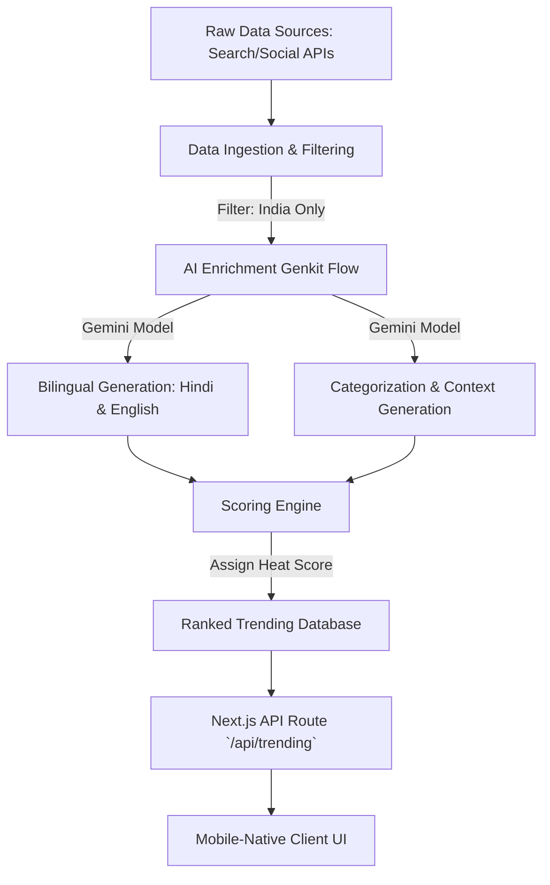

# ShareChat Trending Tags - APM Case Study

## Project Overview

This project is a working prototype of a Trending Tags system for ShareChat, designed for the Indian, Hindi-speaking audience. It automatically identifies what's trending, enriches it with context, and surfaces it in a mobile-native, bilingual UI.

## Tech Stack
- **Frontend**: Next.js 15, React 19, Tailwind CSS, shadcn/ui, Lucide Icons
- **AI / Backend**: Firebase Genkit, Google GenAI (Gemini)
- **Deployment**: Local / Vercel (or similar hosting)

---

## 1. How the System Decides What's Trending

The system uses a multi-stage pipeline to aggregate, filter, and enrich trending topics:

1.  **Sources**: The pipeline pulls raw search queries and traffic data primarily from search engines (e.g., Google Trends India) and social signals.
2.  **Logic & Filters**:
    *   **Geographic Focus**: Filters for topics specifically trending in India.
    *   **Relevance**: Drops obscure foreign news unless it's genuinely viral in India.
    *   **Categorization**: AI automatically categorizes topics into predefined buckets (politics, economy, sports, infrastructure, finance, government, international).
3.  **Weights & Heat Score**: A "Heat Score" (1-10) is assigned based on search volume, the velocity of the trend (how fast it's growing), and cross-platform presence (news vs. social). The feed is ranked descending by this Heat Score.

---

## 2. Workflow Pipeline Diagram

---

## 3. Pipeline Stages & Techniques Used

| Stage | Model / API / Technique | Why we used it |
| :--- | :--- | :--- |
| **Ingestion** | Mocked/Simulated (Google Trends structure) | Simulates real-world search volume and spike velocity. |
| **AI Enrichment** | **Firebase Genkit + Google GenAI (Gemini)** | Used to transform raw queries into clean, professional hashtags (`#पश्चिमबंगालचुनाव`, `#WestBengalElections`) and concise 1-sentence context summaries. Gemini is excellent at translation and contextual understanding for Indian languages. |
| **Scoring** | Custom Heuristic (Heat Score) | Ranks trends not just by absolute volume, but by "freshness" and multi-source presence. |
| **API Layer** | Next.js App Router API | Provides a fast, serverless endpoint to serve the ranked list to the frontend. |

---

## 4. UX Rationale

The prototype was designed to feel **mobile-native, dynamic, and localized**.

*   **What was optimized for**:
    *   **Bilingual First**: Bharat users often switch between English and Hindi. The UI supports an instant language toggle without reloading.
    *   **Scannability**: Clean cards with clear categories, Heat Scores (using a flame icon to indicate vitality), and prominent hashtags.
    *   **Context over Clicks**: The list view provides enough context so the user doesn't *have* to click, but the detail view rewards them with an "AI Context" summary if they do.
*   **What was considered and rejected**:
    *   *Rejected: Standard list view.* Too boring for a social feed. Instead, we used dynamic badges, pulsing "Live" indicators, and category pills.
    *   *Rejected: Infinite scroll for trends.* Trending lists should be curated and finite (Top 10-20) to maintain high quality and relevance.

---

## 5. What I'd Build Next (with 4 more weeks)

If given 4 more weeks, I would build:
1.  **Live API Integrations**: Replace the mock data ingestion with live connections to Twitter API, Google Trends API, and NewsAPIs to pull real-time signals.
2.  **Personalized Trending**: Adjust the Heat Score based on the user's implicit graph (e.g., if a user engages heavily with sports, sports trends get a slight multiplier in their specific feed).
3.  **Content Injection**: Inside the trend detail view, fetch and display 3-5 real ShareChat posts/videos related to the hashtag.
4.  **Trend Lifecycle Tracking**: Visual indicators showing if a trend is "Rising", "Peaking", or "Fading".
5.  **Automated Moderation**: Implement a safety layer to ensure sensitive, graphic, or politically violative topics are flagged for manual review before hitting the trending page.

---

## Links
*   **Hosted Prototype**: [https://trending-news-rose.vercel.app/]
*   **GitHub Repo**: []
*   **Loom Walkthrough**: [Insert URL Here]
